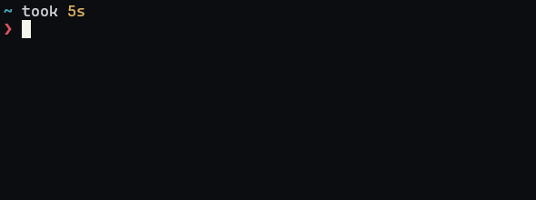

# Terminal SSR

Server side rendered terminal dashboards via curl & SSE



## Usage

### Run Locally

```bash
# Start server
cargo run --quiet

# Render output
curl localhost:8910/info
```
###  Or With a Prebuilt Docker Image

`COMING SOON :)`